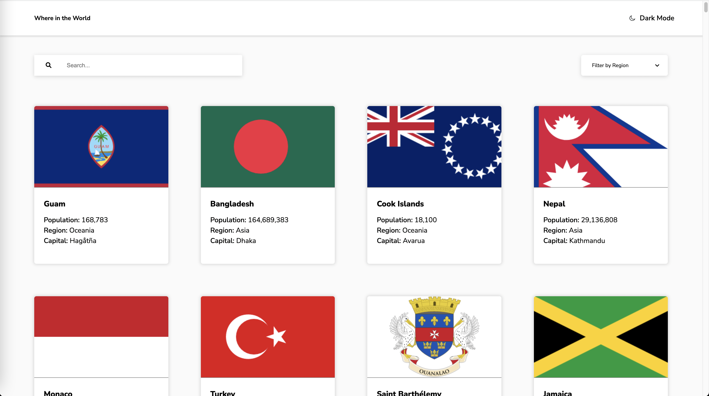

# Frontend Mentor - REST Countries API with color theme switcher solution

This is a solution to the [REST Countries API with color theme switcher challenge on Frontend Mentor](https://www.frontendmentor.io/challenges/rest-countries-api-with-color-theme-switcher-5cacc469fec04111f7b848ca). Frontend Mentor challenges help you improve your coding skills by building realistic projects.

## Table of contents

- [Overview](#overview)
  - [The challenge](#the-challenge)
  - [Screenshot](#screenshot)
  - [Links](#links)
- [My process](#my-process)
  - [Built with](#built-with)
  - [What I learned](#what-i-learned)
- [Author](#author)
- [Project Setup](#project-setup)

## Overview

### The challenge

Users should be able to:

- See all countries from the API on the homepage
- Search for a country using an `input` field
- Filter countries by region
- Click on a country to see more detailed information on a separate page
- Click through to the border countries on the detail page
- Toggle the color scheme between light and dark mode *(optional)*

### Screenshot



### Links

- Solution URL: [Solution on Frontend Mentor](https://www.frontendmentor.io/solutions/rest-country-api-page-using-vuejs-Wr72CtWmxU)
- Live Site URL: [Live Site](https://jls-country-api-page.netlify.app/)

## My process

### Built with

- HTML5
- SCSS
- Mobile-first workflow
- [VueJS](https://vuejs.org/) - JS Framework
- JavaScript Fetch

### What I learned

I learned how to create pages via dynamic routing in VueJS, using the same component for all routes and how to react to route param changes. I also got to deepen my knowledge of getting Data via an API with JavaScript Fetch.

## Author

- Website - [Jan-Luca Splettstößer](https://www.spletti.info)
- Frontend Mentor - [@lucaspl3tti](https://www.frontendmentor.io/profile/lucaspl3tti)
- Github - [@lucaspl3tti](https://github.com/lucaspl3tti)

## Project Setup

```sh
npm install
```

### Compile and Hot-Reload for Development

```sh
npm run dev
```

### Compile and Minify for Production

```sh
npm run build
```

### Lint with [ESLint](https://eslint.org/)

```sh
npm run lint
```
